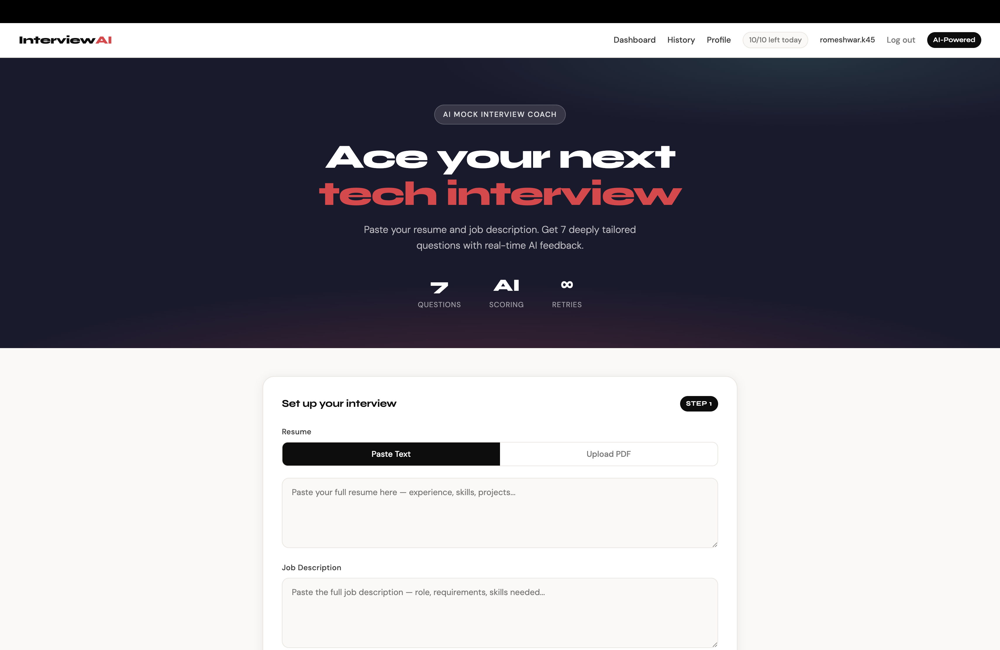
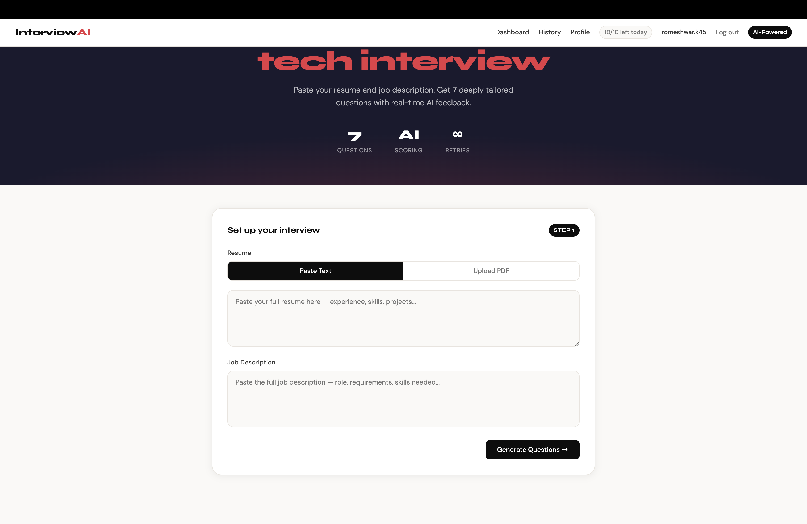
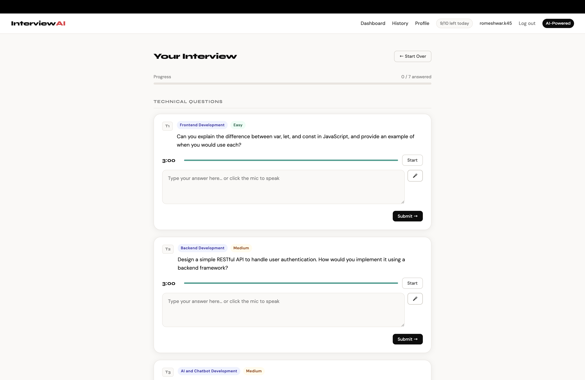
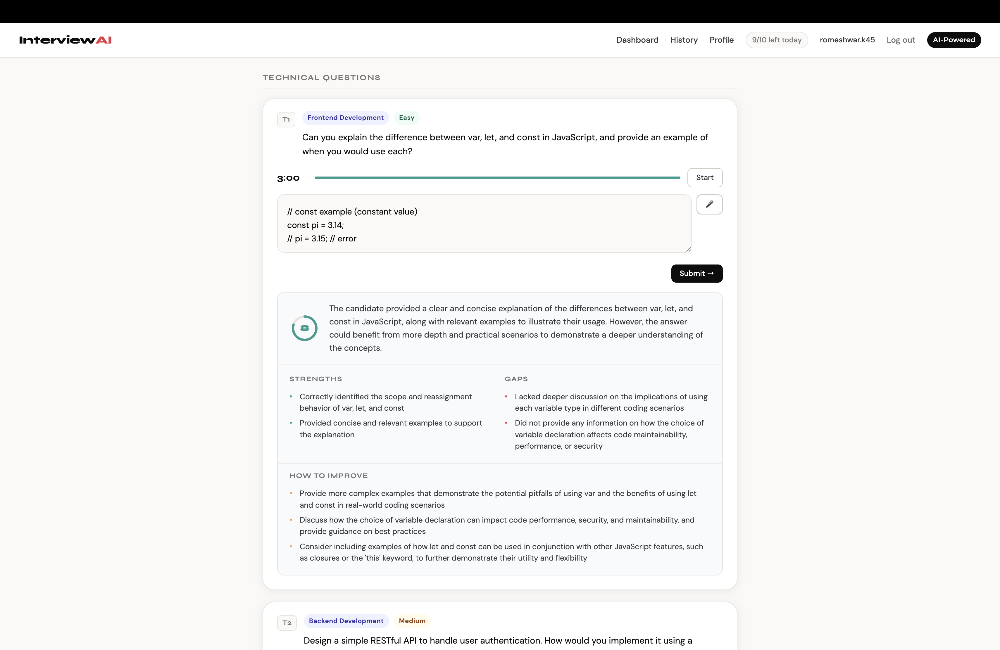
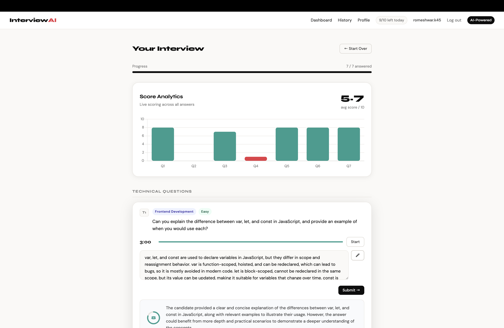
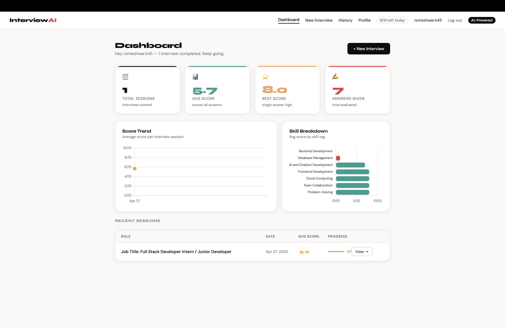
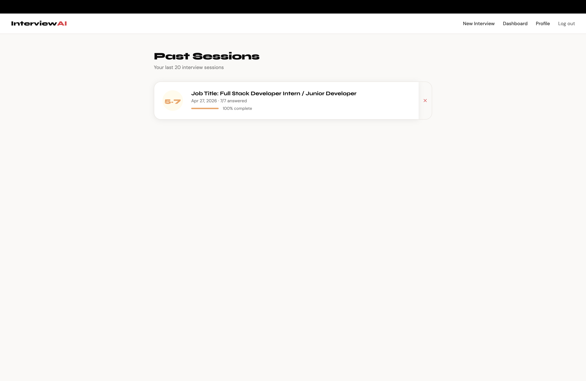
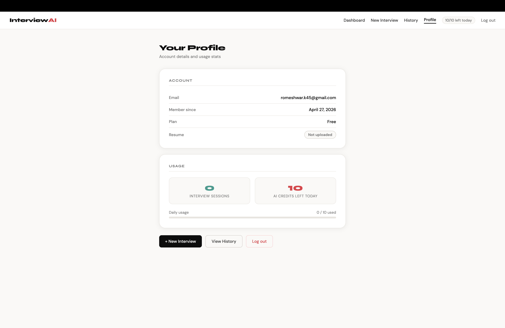
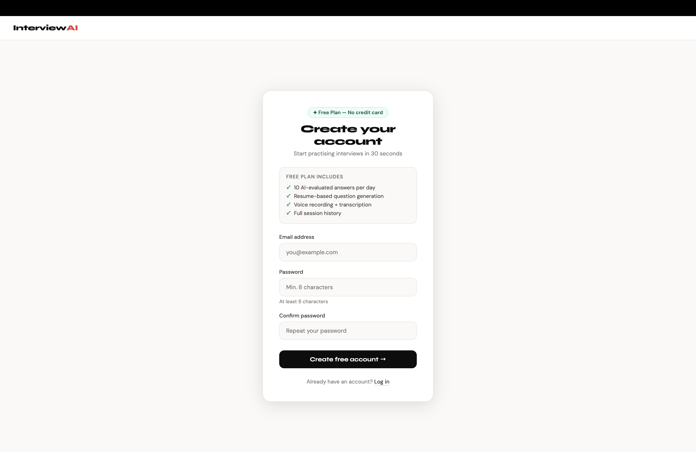

<div align="center">

<br/>

# InterviewAI

### Your Personal AI-Powered Mock Interview Coach

*Paste your resume. Paste the job description. Get 7 deeply tailored questions — technical + behavioural — with real-time AI scoring, feedback, and progress tracking.*

<br/>

[](https://ai-interview-coach-e7ws.onrender.com)
[](https://python.org)
[](https://flask.palletsprojects.com)
[](LICENSE)
[](https://render.com)

<br/>

> **Built as a portfolio project** showcasing Flask backend architecture, secure multi-provider AI integration (Groq / Gemini / OpenAI), voice-to-text transcription, real-world SaaS auth patterns, and a full pytest suite — all deployable with a single click.

<br/>

</div>

---

## 🎬 Live Demo

> **No API key, no setup, no credit card required.**
> The app ships with a built-in **Demo Mode** — all AI responses are replaced with realistic simulated data so you can click through every feature right now.

**👉 [https://ai-interview-coach-e7ws.onrender.com](https://ai-interview-coach-e7ws.onrender.com)**

---

## 📸 Screenshots

### 🏠 Landing — Ace Your Next Tech Interview
> The interview setup hero with a bold dark aesthetic, showing the resume/JD input flow and a real-time stat strip.



---

### 📋 Interview Setup — Resume & Job Description
> Step 1: paste or upload your PDF resume alongside the job description. One click to generate your personalised question set.



---

### 🎯 Interview in Progress — Technical Questions
> 7 questions (5 technical + 2 behavioural), each tagged with skill area and difficulty badge (Easy / Medium / Hard) and a 3-minute per-question countdown timer.



---

### 🤖 Real-Time AI Feedback
> Submit your answer and instantly receive: an overall assessment, a **Strengths** panel, a **Gaps** panel, and exactly 3 actionable *How to Improve* suggestions — all scored 0–10.



---

### 📊 Score Analytics — Session Results
> After completing all 7 questions, see a live bar chart of per-question scores with an average displayed. Red bars highlight questions that need the most work.



---

### 📈 Progress Dashboard — Your Growth Over Time
> Score trend line, skill-by-skill breakdown chart, and a recent sessions table with avg scores and completion rates — all in one view.



---

### 🗂️ Past Sessions — Full History
> Every session you've ever completed, listed with role, date, avg score, and completion percentage. One click to drill into a full session replay.



---

### 👤 User Profile — Account & Usage
> Daily AI credits remaining, total interview sessions, resume upload status, and account details — all on a clean profile page.



---

### 🔐 Authentication — Register & Login
> Clean, minimal auth screens with bcrypt-hashed passwords, CSRF protection, and a "Remember me for 30 days" session option.



---

## ✨ Features

| Feature | What it does |
|---|---|
| **Resume-Tailored Questions** | 5 technical + 2 behavioural questions generated from *your* resume + job description via Groq (LLaMA 3.3), Gemini, or GPT-4o-mini |
| **AI Answer Evaluation** | 0–10 scoring with overall summary, strengths, gaps, and exactly 3 actionable improvement suggestions |
| **Voice Answers** | Record via microphone — OpenAI Whisper transcribes it instantly into the answer box |
| **Per-Question Timer** | 3-minute countdown per question; turns red when time is running low |
| **PDF Resume Upload** | Upload a PDF or paste plain text — stored per user, persists across sessions |
| **Progress Dashboard** | Score trend chart, skill breakdown by tag, session history with avg scores |
| **Demo Mode** | Realistic mock AI responses when no API key is set — zero-friction for reviewers |
| **CSRF Protection** | All state-changing forms and API endpoints protected via Flask-WTF |
| **Secure Auth** | Email + bcrypt passwords, Flask-Login sessions, rate limiting, "remember me" |
| **Daily Usage Quota** | 10 AI-evaluated answers per day, visualised on the profile page |
| **Multi-Provider AI** | Auto-selects Groq → Gemini → OpenAI in order; easily configurable via `.env` |
| **PostgreSQL-Ready** | SQLite in dev, PostgreSQL in prod — zero code changes; ORM handles it all |

---

## 🏗️ Architecture

```
┌─────────────────────────────────────────────────────────────┐
│                        Browser                              │
│  HTML/CSS/JS · Chart.js · Fetch API (voice, resume upload)  │
└──────────────────────────┬──────────────────────────────────┘
                           │ HTTP
┌──────────────────────────▼──────────────────────────────────┐
│                    Flask Application                        │
│                                                             │
│  ┌──────────┐  ┌──────────┐  ┌──────────┐  ┌──────────┐   │
│  │  auth/   │  │ main/    │  │interview/│  │  api/    │   │
│  │blueprint │  │dashboard │  │ app route│  │transcribe│   │
│  └──────────┘  └──────────┘  └──────────┘  │upload    │   │
│                                             │scores    │   │
│  ┌──────────┐  ┌──────────┐                └──────────┘   │
│  │ history/ │  │ profile/ │                               │
│  │blueprint │  │blueprint │                               │
│  └──────────┘  └──────────┘                               │
│                                                             │
│  ┌─────────────────────────────────────────────────────┐   │
│  │              ai_service.py  (AI layer)              │   │
│  │                                                     │   │
│  │  DEMO_MODE? ──yes──▶ demo_data.py (mock responses) │   │
│  │       │                                             │   │
│  │       no                                            │   │
│  │       ▼                                             │   │
│  │  question_generator.py ──▶ Groq / Gemini / GPT     │   │
│  │  evaluator.py          ──▶ Groq / Gemini / GPT     │   │
│  │  transcribe_audio()    ──▶ OpenAI Whisper          │   │
│  └─────────────────────────────────────────────────────┘   │
│                                                             │
│  ┌─────────────────────────────────────────────────────┐   │
│  │        SQLAlchemy ORM  ──▶  SQLite / PostgreSQL     │   │
│  │  User · InterviewSession · Evaluation               │   │
│  └─────────────────────────────────────────────────────┘   │
└─────────────────────────────────────────────────────────────┘
```

---

## 🗂️ Project Structure

```
interview-ai/
├── src/
│   ├── app.py                  # App factory (create_app)
│   ├── config.py               # Config classes (prod + test)
│   ├── models.py               # SQLAlchemy models + indexes
│   ├── auth.py                 # Auth blueprint
│   ├── ai_service.py           # AI layer with demo mode detection
│   ├── demo_data.py            # Realistic mock questions & evaluations
│   ├── question_generator.py   # Question generation (Groq/Gemini/GPT)
│   ├── evaluator.py            # Answer evaluation (Groq/Gemini/GPT)
│   ├── pdf_parser.py           # PyMuPDF text extraction
│   ├── prompts.py              # Prompt templates
│   └── blueprints/
│       ├── main.py             # / and /dashboard
│       ├── interview.py        # /app (interview flow)
│       ├── history.py          # /history/*
│       ├── api.py              # /api/transcribe, /api/upload-resume, /api/scores
│       └── profile.py          # /profile
├── templates/
│   ├── landing.html
│   ├── index.html              # Interview UI
│   ├── dashboard.html
│   ├── history.html
│   ├── session_detail.html
│   ├── profile.html
│   └── auth/
│       ├── login.html
│       └── register.html
├── static/
│   ├── uploads/                # Temp audio files (gitignored)
│   └── resumes/                # Per-user resume PDFs (gitignored)
├── tests/
│   ├── conftest.py             # pytest fixtures (demo mode, test DB)
│   ├── test_auth.py            # Register, login, logout, duplicate email
│   ├── test_interview.py       # Full interview flow in demo mode
│   └── test_resume.py          # Resume upload/delete, API endpoints
├── tests.py                    # Legacy unit tests
├── requirements.txt
├── render.yaml                 # Render.com one-click deployment
└── .env.example
```

---

## 🧰 Tech Stack

| Layer | Technology |
|---|---|
| **Backend** | Python 3.11, Flask 3.0, Gunicorn |
| **Auth & Security** | Flask-Login, bcrypt, Flask-WTF CSRF |
| **Database** | SQLite (dev) / PostgreSQL (prod) via Flask-SQLAlchemy |
| **AI — Questions & Eval** | Groq (LLaMA 3.3-70b, default) · Gemini (gemini-2.0-flash) · OpenAI (GPT-4o-mini) |
| **AI — Voice** | OpenAI Whisper (speech-to-text) |
| **PDF Parsing** | PyMuPDF (fitz) |
| **Frontend** | Vanilla HTML/CSS/JS, Chart.js, Google Fonts |
| **Deployment** | Render.com (`render.yaml` included) |
| **Tests** | pytest + pytest-flask |

---

## ⚡ Demo Mode

Demo Mode activates **automatically** when no AI provider key is found. No manual toggle needed.

It activates when:
- `GROQ_API_KEY`, `GEMINI_API_KEY`, and `OPENAI_API_KEY` are all missing or empty
- `DEMO_MODE=true` is explicitly set in `.env`

What you get in Demo Mode:
- Realistic set of 5 technical + 2 behavioural questions
- AI evaluations with realistic scores (5–9), structured feedback, strengths, gaps, and 3 improvement suggestions
- Voice transcription returns a placeholder
- A yellow banner appears on all pages indicating Demo Mode is active

> API keys are **only ever used on the backend** via environment variables. The frontend never receives, stores, or transmits provider keys.

```bash
# Zero-config quick start:
cp .env.example .env      # only SECRET_KEY needed
flask --app src/app run
# Visit http://127.0.0.1:5000 — full app, zero API key
```

---

## 🚀 Local Setup

### 1. Clone & Install

```bash
git clone https://github.com/romesh45/AI-Interview-Coach.git
cd AI-Interview-Coach
pip install -r requirements.txt
```

### 2. Configure Environment

```bash
cp .env.example .env
```

Edit `.env`:

```env
# Required — generate with: python -c "import secrets; print(secrets.token_hex(32))"
SECRET_KEY=your-random-secret-key

# AI provider: auto | groq | gemini | openai
AI_PROVIDER=auto

# Recommended: Groq (fastest, free tier available)
GROQ_API_KEY=your-groq-api-key

# Optional: override Groq model
# GROQ_MODEL=llama-3.3-70b-versatile

# Optional: Gemini fallback
# GEMINI_API_KEY=your-gemini-api-key
# GEMINI_MODEL=gemini-2.0-flash

# Optional: OpenAI fallback
# OPENAI_API_KEY=sk-...
```

### 3. Run

```bash
flask --app src/app run --port 5001
```

Visit `http://127.0.0.1:5001`, register an account, and start your first mock interview.

---

## 🧪 Running Tests

The entire test suite runs in Demo Mode — **no API key required.**

```bash
# Full pytest suite (auth + interview flow + resume API)
pytest tests/ -v

# Legacy unit tests (mocked OpenAI client)
python tests.py
```

Test coverage includes:
- User registration, login, logout, duplicate email rejection
- Full interview flow end-to-end in demo mode
- Resume upload, delete, and API endpoint validation

---

## ☁️ Deployment on Render

1. Push to GitHub
2. Go to [render.com](https://render.com) → **New Web Service**
3. Connect your repo — Render auto-detects `render.yaml`
4. Set environment variables:
   - `AI_PROVIDER=auto` (or `groq`)
   - `GROQ_API_KEY=<your key>`
   - `GROQ_MODEL=llama-3.3-70b-versatile` (optional)
5. Deploy — `SECRET_KEY` is auto-generated by Render

**To use PostgreSQL on Render:** add a PostgreSQL database resource. Render sets `DATABASE_URL` automatically and the app picks it up — no code changes needed.

---

## 🧠 Key Design Decisions

**App factory pattern** — `create_app()` in `src/app.py` enables clean, isolated testing with an in-memory SQLite database and disabled CSRF, without touching production config.

**Centralised AI service layer** — `ai_service.py` is the single entry point for all AI calls. Provider selection and demo mode detection happen once at import time (`DEMO_MODE: bool = _resolve_demo_mode()`), keeping every blueprint and route blissfully unaware of whether it's talking to Groq, OpenAI, or mock data.

**Lazy AI client initialisation** — `question_generator.py` and `evaluator.py` initialise the AI client on first call (not at import), so the modules are safely importable in demo mode or tests with no valid API key present.

**Multi-provider fallback** — `AI_PROVIDER=auto` tries Groq first (fastest, cheapest), then Gemini, then OpenAI. Override with a specific value in `.env` to lock in a provider.

**PostgreSQL-ready from day one** — The config layer normalises Render's `postgres://` URL scheme to `postgresql://` (a SQLAlchemy quirk), and the ORM schema is identical between SQLite and PostgreSQL — switch databases without touching a single model.

**CSRF on every mutation** — All state-changing routes (login, register, interview submit, resume upload/delete) are protected with Flask-WTF CSRF tokens.

---

## 📁 Screens Quick Reference

| Screen | Route | Description |
|---|---|---|
| Landing / Interview | `/app` | Hero + Step 1 resume/JD input |
| Dashboard | `/dashboard` | Score trend, skill breakdown, recent sessions |
| History | `/history` | Past 20 sessions with scores and completion |
| Session Detail | `/history/<id>` | Full replay of a past session |
| Profile | `/profile` | Account info, resume status, daily quota |
| Register | `/register` | Free plan sign-up |
| Login | `/login` | Email + password auth |

---

## 🤝 Contributing

Pull requests are welcome! For major changes, open an issue first to discuss what you'd like to change.

1. Fork the repository
2. Create a feature branch: `git checkout -b feature/your-feature`
3. Commit your changes: `git commit -m 'Add some feature'`
4. Push to the branch: `git push origin feature/your-feature`
5. Open a Pull Request

---

## 📄 License

This project is licensed under the **MIT License** — see the [LICENSE](LICENSE) file for details.

---

<div align="center">

**Built with ❤️ by [Romeshwar K](https://github.com/romesh45)**

⭐ If you found this project useful, please consider giving it a star!

[](https://github.com/romesh45/AI-Interview-Coach/stargazers)

</div>
